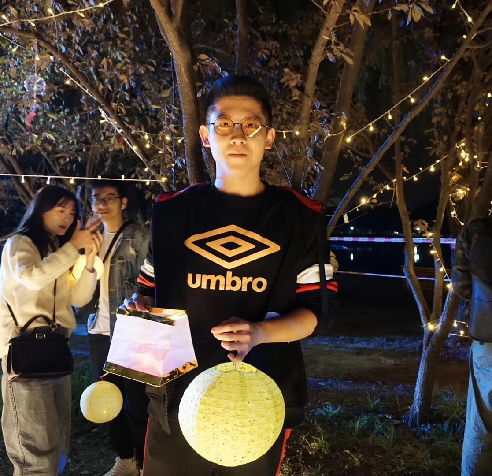

<table border="0">
  <tr>
    <td width="75%">
      <h1>Cui Ziteng</h1>
      
<b>Master Student</b>

      
<b>Shanghai Jiaotong University</b>

      
<b>Supervisor:Zhang Zenghui</b>

      
<b>Mail：2037346204@qq.com</b>
  
    </td>
    <td width="25%">
            
    </td>
  </tr>
</table>

### Interest Area:
#### Remote Sensing Image Processing, Graph Neural Network, Object detcetion
### Education:
#### Harbin Institue of Technology(bachelor) 2014——2018
#### Shanghai Jiaotong University(master) 2019——now
### Publishments:
#### ELLIPSE-FCN: OIL TANKS DETECTION FROM REMOTE SENSING IMAGES WITH FULLY CONVOLUTION NETWORK(IGARSS 2020, oral)Ziteng Cui, Weiwei Guo∗, Zenghui Zhang, Huiyuan Chen, Wenxian Yu

